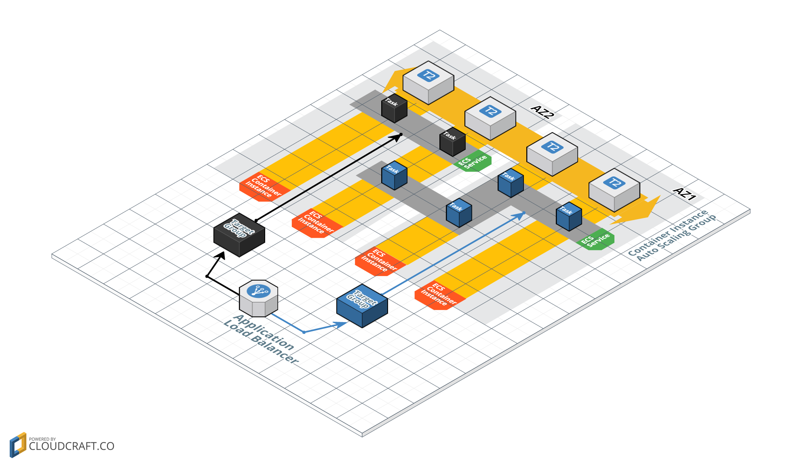

# Overview
This is a *sample microservice* application built with [Spring Boot](http://projects.spring.io/spring-boot/) and [Docker](https://www.docker.com/), deployed on Amazon ECS, to manage bananas :banana:



Review the steps below to learn how it was created and how to create your own:

# Step 1: Set up your environment

You will need to install the [Spring Boot CLI](http://docs.spring.io/spring-boot/docs/current/reference/htmlsingle/#getting-started-installing-the-cli) to get started.  The recommended way is to use [SDKMAN!](http://sdkman.io/index.html).  First install SDKMAN! with:

```
$ curl -s "https://get.sdkman.io" | bash
```

Then, install Spring Boot with:

```
$ sdk install springboot
```

Alternatively, you could install with [Homebrew](http://brew.sh/):

```
$ brew tap pivotal/tap
$ brew install springboot
```

Or [MacPorts](http://www.macports.org/):

```
$ sudo port install spring-boot-cli
```

# Step 2: Scaffold out your microservice project

Use the Spring Boot CLI to create a project:

```
$ spring init --build=gradle --package-name=com.stelligent --dependencies=web,actuator,hateoas -n Banana microservice-exemplar
```

# Step 3: Create a REST domain, repository, resource and controller

write some code...


# Step 4: Run it locally

Start the app by running:

```
$ gradle bootRun
``` 

Try it out:

```
$ curl http://localhost:8080/bananas
```


# Step 5: Create a Docker image

Create a dockerfile:

```
  FROM java:8
  MAINTAINER Casey Lee email: casey.lee@stelligent.com
  ADD microservice-exemplar-0.1.0.jar app.jar
  ENTRYPOINT ["java","-Djava.security.egd=file:/dev/./urandom","-jar","/app.jar"]
```

Update gradle to build the docker image:

```
buildscript {
    ...
    dependencies {
        ...
        classpath('se.transmode.gradle:gradle-docker:1.2')
    }
}

group = 'stelligent'

...
apply plugin: 'docker'

task docker(type: Docker, dependsOn: build) {
  push = false
  applicationName = jar.baseName
  dockerfile = file('src/main/docker/Dockerfile')
  doFirst {
    copy {
      from jar
      into stageDir
    }
  }
}
```

Then run:

```
$ gradle dockerBuild
```
 

Run it with:

```
$ docker run -p 8080:8080 -t stelligent/microservice-exemplar
```

# Step 6: Deploy to ECS

Setup the stack with:

```
$ gradle platformUp
```

Push latest image to ECR and update the ECS service:
```
$ gradle deploy
```
